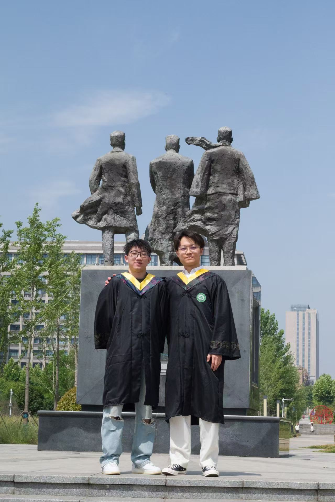

# About Me

Here is **Haoyu Wang (Randall, 王浩宇)**. 

I am a Ph.D. student in the college of Cybersecurity at the Southeast University, Prior to SEU,  I have worked on AI4Agri, AIoT and Visualization with _Prof. Wu_. 

If you are interested in any aspect of me, I am always open to discussions and collaborations. Feel free to reach out to me at _randall_hy[at]163.com_

---

## Research Interests

**I am actively seeking a position for 2025 Fall admission. If you have any information, please contact me!**

- Artificial Intelligence Security
- Intrusion detection systems powered by AI
- Adversarial attacks and defenses
- Fairness, accountability, and transparency in AI

My current research focuses on practical problems that artificial intelligence faces in real life. My interests are on the **Machine Learning** and  **Artificial Intelligence Security**. In a word, advanced technologies like ML and AI Security positively influence the life of everybody.  I wish to devote my talent to this meaningful cause and bring well-being to society.

---

## Work/Intern Experience:
  - Intern of TP at VWAC From 2023.10.20-2024.1.20

---

## News and Updates

<!-- - **June 2024**：Very excited to be selected as [KDD UC Scholar](https://kdd2024.kdd.org/undergraduate-consortium/). See you in Spain!
- **May 2024：**My bachelor thesis won the Annual Best Thesis Award (Top 1/300).
- **April 2024：**Our work *BLEGuard* has been accepted to [MobiSys 2024](https://www.sigmobile.org/mobisys/2024/) as a poster paper. See you in Japan!
- **March 2024：**Very excited to get a MPhil offer from Engineering department at Cambridge University! -->
- **June 2024：**Very excited to be awarded as the Outstanding Graduates of Anhui Province!
- **Sept 2021：**Started research programme at [AIE Lab Room 766], advised by _Prof. Wu_.

 

<!-- <blockquote class="twitter-tweet">
Thrilled to be an AAAI-UC Scholar at <a href="https://twitter.com/hashtag/AAAI24?src=hash&amp;ref_src=twsrc%5Etfw">#AAAI24</a>, thanks to <a href="https://twitter.com/hashtag/AAAI?src=hash&amp;ref_src=twsrc%5Etfw">#AAAI</a> &amp; <a href="https://twitter.com/hashtag/GoogleExploreCSR?src=hash&amp;ref_src=twsrc%5Etfw">#GoogleExploreCSR</a> for the sponsorship. Grateful for the knowledge gained and new friendships formed.  Wonderful trip in Vancouver. Looking forward to staying connected with all.<a href="https://twitter.com/hashtag/AAAI24?src=hash&amp;ref_src=twsrc%5Etfw">#AAAI24</a> <a href="https://twitter.com/hashtag/Vancouver?src=hash&amp;ref_src=twsrc%5Etfw">#Vancouver</a> <a href="https://twitter.com/hashtag/GoogleExploreCSR?src=hash&amp;ref_src=twsrc%5Etfw">#GoogleExploreCSR</a> <a href="https://t.co/wUQUp8XlSM">pic.twitter.com/wUQUp8XlSM</a>
&mdash; Hanlin CAI (seeking a PhD position 2025) (@lancecai2002) <a href="https://twitter.com/lancecai2002/status/1762210025173344260?ref_src=twsrc%5Etfw">February 26, 2024</a></blockquote>  -->

