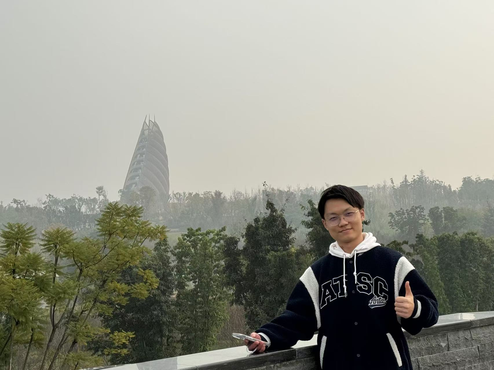

# About Me

Hi, I am **Haoyu Wang (王浩宇)**.

I am an M.Phil. student in Artificial Intelligence at **The Chinese University of Hong Kong, Shenzhen (CUHK-SZ)**, starting from Sept. 2025. 
Previously, I received my B.Eng. degree in Computer Science and Technology from **Anhui Agricultural University** in June 2024, graduating as an **Outstanding Graduate of Anhui Province**.

My research journey includes experiences at **Southeast University** and **Beijing QiAnXin Technology Research Institute**.
I am passionate about **Multimodal Large Models (VLM)**, **Computer Vision (CV)**, and **AI Safety**.

If you are interested in any aspect of my work, feel free to reach out to me at *225085019[at]link.cuhk.edu.cn*.

---

## Research Interests

- **Multimodal Large Models (VLM)**
- **Computer Vision (CV)**
- **Machine Learning (ML)**
- **AI Safety**

My current research focuses on practical problems that artificial intelligence faces in real life, particularly in the safety and capabilities of large models.

---

## Education

- **The Chinese University of Hong Kong, Shenzhen (CUHK-SZ)** (Sept. 2025 -- Present)
  - **M.Phil. in Artificial Intelligence**
  - Shenzhen, China.

- **Anhui Agricultural University** (Sept. 2020 -- June 2024)
  - **B.Eng. in Computer Science and Technology**
  - Hefei, China.
  - **GPA:** 88.78/100 | **Rank:** 2/423 (Top 0.5%) | **IELTS:** 7.0
  - **Awards:** Outstanding Graduate of Anhui Province; National Scholarship equivalent (Merit Student).

---

## Research & Intern Experience

- **Beijing QiAnXin Technology Research Institute** (July 2025 -- Nov. 2025)
  - *Algorithm Research Intern (LLM & API Safety)* | Beijing, China
  - Engineered an automated pipeline to clean 300k+ HTTP logs using semantic clustering, which improved data validity from 40% to 80% for model fine-tuning.
  - Explored automated security testing workflows using LLM Agent tools (e.g., BrowserUse) and evaluated their efficacy in high-risk operation scenarios.

- **Southeast University (Key Lab of Network & Info Security)** (Dec. 2024 -- June 2025)
  - *Core Researcher (NSFC Project): Intelligent Identification of Encrypted Traffic* | Nanjing, China
  - Designed a Deep Learning-based temporal feature extraction network to process high-dimensional sequential data for cloud encrypted traffic identification.
  - Conducted inverse analysis on unknown protocols and utilized sequence models to capture spatiotemporal correlations, significantly improving identification accuracy in complex environments.

- **Anhui Zhongke Jingge Co., Ltd.** (Mar. 2024 -- June 2024)
  - *Algorithm Research Intern (RAG & SFT)* | Hefei, China
  - Fine-tuned Llama 3 via LoRA for Text-to-Shell conversion; optimized Rank/Alpha parameters for high-precision command generation.
  - Architected a Retrieval-Augmented Generation (RAG) system with vector databases, effectively mitigating model hallucinations in private domain tasks.

- **MiniMind-V: End-to-End Lightweight Multimodal Large Model** (Dec. 2025 -- Jan. 2026)
  - *Project Lead, CUHK-SZ* | Shenzhen, China
  - Constructed a VLM from scratch using a ViT encoder and Llama-based decoder; manually implemented the Projector (MLP) for Cross-modal Alignment.
  - Built a full-stack training framework (Pre-train & SFT) with Automatic Mixed Precision (AMP) and dynamic batching; successfully injected instruction-following capabilities on consumer-grade GPUs.

<!--
- **AIE Lab of AHAU** (2021.10 - 2023.10)
  - Research Assistant
-->

---

## Technical Skills
- **Languages & Tools:** Python, C/C++, PyTorch, MATLAB, SQL, Docker, Linux, Git.
- **Core Competencies:** LLM Training (Pre-train/SFT/DPO), Multimodal Learning, RAG, Agentic Workflow.

---

## News and Updates

- **June 2024：**Very excited to be awarded as the Outstanding Graduates of Anhui Province!
- **Sept 2021：**Started research programme at [AIE Lab Room 766], advised by _Prof. Wu_.

